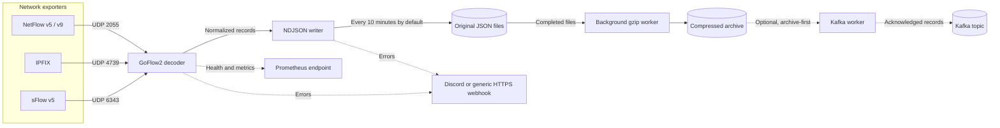
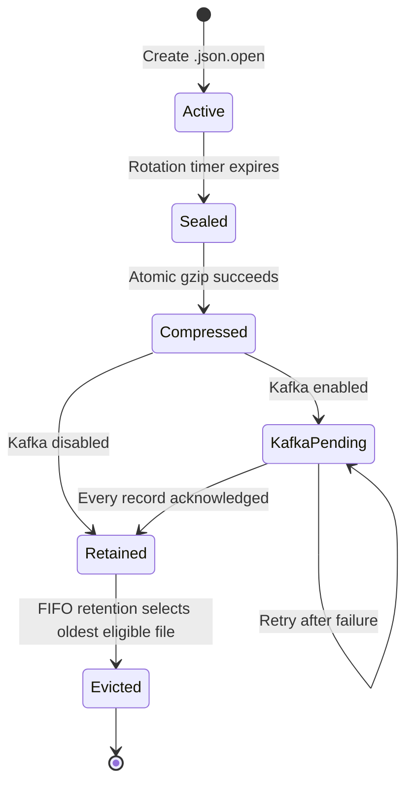
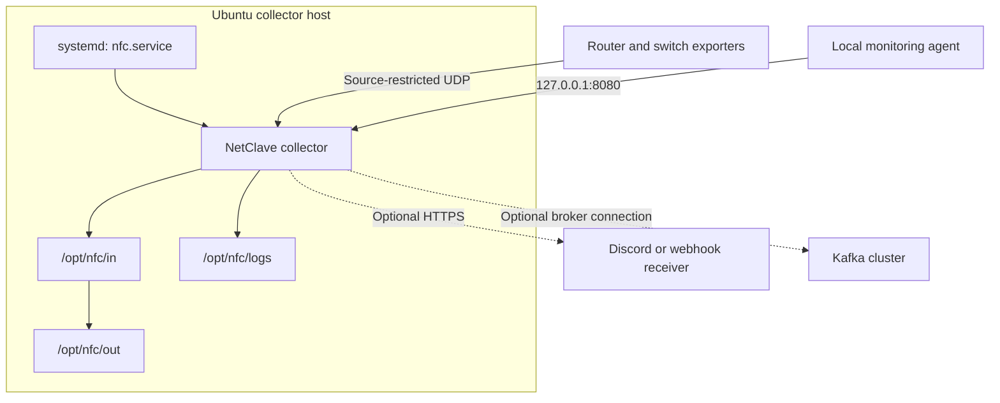

# NetClave

**Network flows. Under your control.**

NetClave is a self-hosted network-flow collection and archive pipeline for Ubuntu. It uses GoFlow2 to decode supported exporter traffic, writes normalized records as newline-delimited JSON, rotates files on a configurable schedule, and compresses completed files in a separate worker.

The local JSON archive is the system of record. Kafka delivery and HTTPS alerts are optional integrations, so a broker or external notification service is not required for basic collection.

## How NetClave works



Collection and background processing are intentionally separated. The main collection loop writes complete JSON records and rotates the active file. Gzip and optional Kafka delivery run independently so the collector does not wait for a compression or broker operation to finish. Disk I/O, `fsync`, CPU contention, and kernel UDP limits can still affect throughput, so production sizing and monitoring remain important.

## File lifecycle



By default, NetClave retains the latest 144 completed original JSON files, plus the active file. Gzip archives have their own retention setting, also 144 by default. If compression fails, the original remains. If Kafka is enabled and unavailable, unacknowledged archives remain. These safeguards can temporarily exceed the configured file limit to preserve recoverable data.

## Core capabilities

| Capability | What it provides |
|---|---|
| Multi-protocol collection | NetFlow v5/v9, IPFIX, and sFlow v5 through configurable UDP listeners |
| Normalized JSON | One complete JSON object per line for streaming, inspection, and recovery |
| Scheduled rotation | New files every 10 minutes by default, including idle intervals |
| Background compression | Gzip levels 1–9 with temporary output and atomic publication |
| FIFO retention | Independent limits for original and compressed files |
| Restart-aware recovery | Seals interrupted files, preserves complete records, and trims incomplete tails |
| Durable checkpoints | Compression and Kafka delivery work resumes after restart |
| Central configuration | Intervals, directories, listeners, logging, retention, and integrations in `nfc.json` |
| Operational logging | Configurable DEBUG, INFO, WARNING/WARN, ERROR, or CRITICAL levels with file rotation |
| Health and metrics | GoFlow2 health and Prometheus endpoints on loopback by default |
| Host safeguards | Dedicated service account, restricted writable paths, spool locks, and verified binary downloads |
| Firewall review | Read-only UFW inspection with source-restricted rule suggestions |

## Integrations

| Integration | Role | Default |
|---|---|---|
| [GoFlow2](https://github.com/netsampler/goflow2) | Decodes and normalizes supported flow protocols | Required, pinned to 2.2.6 |
| Apache Kafka | Publishes one JSON record per message from completed archives | Disabled |
| Discord webhooks | Sends rate-limited error notifications to a Discord channel | Disabled |
| Generic HTTPS webhooks | Sends structured JSON error events to a receiver you control | Disabled |
| Prometheus | Scrapes GoFlow2 operational metrics | Available on loopback |
| systemd | Starts, supervises, restarts, and logs the collector service | Required on the target Ubuntu host |
| UFW | Restricts inbound exporter traffic by source address and port | Inspected but never changed automatically |

### Kafka delivery model

Kafka is useful when multiple downstream consumers, centralized processing, or replay justify operating a broker. NetClave's Kafka mode mirrors the completed local archive. It does not replace local files and is not a real-time, broker-first topology.

The producer requires `acks=all` and idempotence. A file is checkpointed only after all records are acknowledged. A crash or partial failure can replay an entire file, so delivery is **at least once** rather than exactly once. Each message has a deterministic `<archive-filename>:<line-number>` key that consumers can use for deduplication.

### Webhook alerting

Discord and generic HTTPS webhook delivery use a separate bounded worker, a configurable timeout, and a minimum interval between attempts. Discord mentions are disabled. Alerts are best-effort; detailed errors remain in the collector log and systemd journal. The exact Discord webhook URL must be copied from the destination Discord server and treated as a secret.

## Default operating policy

```json
{
  "rotation_minutes": 10,
  "keep_original_files": 144,
  "keep_gzip_files": 144,
  "json_directory": "/opt/nfc/in",
  "gzip_directory": "/opt/nfc/out",
  "log_directory": "/opt/nfc/logs",
  "log_level": "INFO",
  "gzip_level": 6
}
```

The complete supplied `nfc.json` also contains listener, metrics, webhook, Kafka, buffering, durability, and firewall settings.

## Protocol support

| Input | Supported versions | Default listener |
|---|---|---|
| NetFlow | v5 and v9 | UDP 2055 |
| IPFIX | IPFIX / NetFlow v10 | UDP 4739 |
| sFlow | v5 | UDP 6343 |

NetClave does not add protocol support beyond GoFlow2. Legacy NetFlow v1/v7/v8, older sFlow versions, and TCP/SCTP IPFIX are not supported by this package. NetFlow v9 and IPFIX require templates from the exporter. Output contains normalized supported fields; it is not a packet capture or a lossless copy of every vendor-specific field.

## Deployment model



The installer targets Ubuntu 26.x with systemd on amd64, arm64, or armhf. It installs missing system packages, downloads the official GoFlow2 binary, verifies its release SHA-256 digest, creates a non-login `nfc` account, and installs the service. It does not start collection or modify UFW rules automatically.

## Operational boundaries

- UDP delivery is inherently lossy. Validate kernel receive buffers, exporter behavior, CPU, disk throughput, and actual flow rates.
- The health endpoint reports GoFlow2 availability; it does not prove archive, Kafka, webhook, or end-to-end exporter health.
- A full data disk causes collection to fail. Monitor disk headroom independently.
- Retention may exceed its target while compression or Kafka delivery is failing. This preserves pending data but requires sufficient spool capacity.
- Power loss can lose records since the last successful `fsync`, plus data still in the kernel or process pipeline.
- Configuration changes require a service restart. Enabling Kafka or changing data directories also requires rerunning the installer.

## Validation status

The package passed 13 automated tests, including synthetic UDP traffic through the official GoFlow2 binary for NetFlow v5, NetFlow v9, IPFIX, and sFlow v5. Tests also cover timed rotation, gzip integrity, FIFO retention, restart recovery, simulated compression failure, simulated Kafka acknowledgements and outages, and webhook failure redaction.

Ubuntu installation, target-host UFW behavior, live Discord/Kafka delivery, and production throughput must still be validated in the deployment environment.

## Product page

Coming soon.  Be sure to check out https://cyberconclave.io for further details or contact dev@cyberconclave.io

